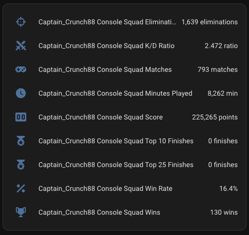
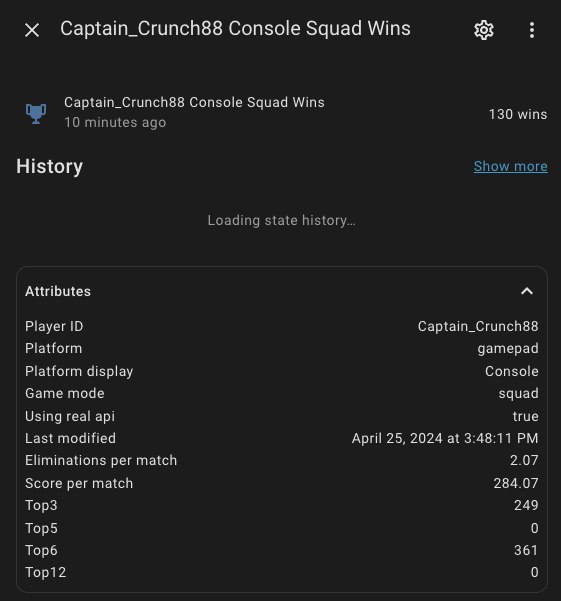

# Fortnite Stats Sensors

[![GitHub Release][releases-shield]][releases]
[![GitHub Activity][commits-shield]][commits]
[![License][license-shield]](LICENSE)

[![hacs][hacsbadge]][hacs]
![Project Maintenance][maintenance-shield]
[![BuyMeCoffee][buymecoffeebadge]][buymecoffee]

[![Discord][discord-shield]][discord]
[![Community Forum][forum-shield]][forum]

_Component to integrate with [fortnite][fortnite]._

![fortnite-logo][fortnite-logo-img]

# Fortnite Stats

This 'fortnite' component is a Home Assistant custom sensor which shows you various stats accumulated while playing the very popular F2P game, [Fortnite: Battle Royale](https://www.epicgames.com/fortnite/en-US/home). 

## Why?

It can show you how well you're playing the game with stats like:
- How many eliminations you've earned
- Kill/Death Ratio
- Eliminations Per Game
- Total Matches Played Per Mode
- Your Fortnite Score
- Your Score Earned Per Match
- Your Win Ratio

And how many times you finish in the:
- Top 1
- Top 3
- Top 5
- Top 6
- Top 10
- Top 12
- Top 25

## Purpose

This is my first Home-Assistant Custom Component, so it's been a fun learning experience for me contributing to Open Source Software! This wouldn't been possible without the help from @xcodinas for building the fortnite-python library and from @clyra for helping refine my initial script and idea by further developing it towards a more finished product. From there I've added some extra tweaks, wrote the documentation, and published it in the Home-Assistant Community Store (HACS).

## Screenshots

### Sensor List View

*Clean sensor names showing Console/PC platforms with all game modes and statistics*

### Detailed Sensor View

*Detailed sensor view showing wins, attributes, and real-time data from fortnite-api.com*

**This component will set up the following platforms.**

Platform | Description
-- | --
`sensor` | Show stats pulled from fortnite API on https://fortnite-api.com/

## Manual Installation

Download the fortnite.zip file from the latest release.
Unpack the release and copy the custom_components/fortnite directory into the custom_components directory of your Home Assistant installation.
Configure the fortnite sensor.
Restart Home Assistant.

## Installation via HACS (Preferred Method)
1. Ensure that HACS is installed
2. Search for and install the "Fortnite Stats" integration
3. Restart Home Assistant
4. Add the integration via the UI (see Configuration section above)

## Configuration via UI

**Note**: As of version 2.0, this integration uses the modern Home Assistant UI configuration instead of YAML and has been completely modernized for Home Assistant 2024+.

### Getting Your API Key

1. Visit [fortnite-api.com](https://fortnite-api.com/)
2. Click **Dashboard / Docs** in the navigation
3. Sign up for a free account or log in
4. Navigate to the **API Keys** section
5. Generate a new API key for your Home Assistant integration
6. Copy the API key (you'll need this for setup)

### Getting Your Epic Username

Your Epic username is the display name you use in Fortnite. This is different from your Epic Games account email. You can find it by:

1. Launch Fortnite
2. Look at the top-right corner of the main menu - your display name is shown there
3. Or check your Epic Games profile at [epicgames.com](https://www.epicgames.com/account/personal)

**Note**: Use your Epic display name, not your Epic Games account email.

### Setup Steps

1. Go to **Settings** > **Devices & Services**
2. Click **Add Integration**
3. Search for **Fortnite Stats**
4. Follow the setup wizard:
   - Enter your Fortnite API key (from fortnite-api.com)
   - Enter your Epic username/display name
5. The integration will automatically create sensors for all platforms and game modes

### What You Get

The integration automatically creates **54 sensors** covering all platforms and game modes:

**Platforms:**
- **Console** (Xbox, PlayStation, Nintendo Switch)
- **PC** (Keyboard & Mouse)

**Game Modes:**
- **Solo** - Individual battle royale matches
- **Duo** - Two-player team matches  
- **Squad** - Four-player team matches

**Stats for Each Combination:**
- Eliminations, Wins, Matches, Win Rate, K/D Ratio
- Top 10 Finishes, Top 25 Finishes, Score, Minutes Played

### Example Sensors Created

For username `Captain_Crunch88`, you'll get sensors like:
- `sensor.captain_crunch88_console_squad_eliminations`
- `sensor.captain_crunch88_console_squad_wins`
- `sensor.captain_crunch88_pc_solo_eliminations`
- `sensor.captain_crunch88_console_duo_win_rate`
- And 50 more...

## Features

- **Real-time Updates**: Automatic updates every 5 minutes
- **Multiple Platforms**: Tracks both Console and PC gameplay
- **All Game Modes**: Solo, Duo, and Squad statistics
- **Comprehensive Stats**: 9 different statistics per platform/mode combination
- **Modern Architecture**: Built for Home Assistant 2024+ with async/await patterns
- **Easy Setup**: Just API key and username - no complex configuration

## This custom-component (v2.0.0) is compatible with Home Assistant 2023.1.0 and later

**⚠️ Breaking Change**: Version 2.0.0 introduces significant changes. See the [Migration Guide](MIGRATION_GUIDE.md) for upgrade instructions.

## Contributions are welcome!

If you want to contribute to this please read the [Contribution guidelines](CONTRIBUTING.md)

***

[fortnite]: https://github.com/michaellunzer/Home-Assistant-Custom-Component-Fortnite
[buymecoffee]: https://www.buymeacoffee.com/michaellunzer
[buymecoffeebadge]: https://img.shields.io/badge/buy%20me%20a%20coffee-donate-yellow.svg?style=for-the-badge
[commits-shield]: https://img.shields.io/github/commit-activity/y/michaellunzer/Home-Assistant-Custom-Component-Fortnite.svg?style=for-the-badge
[commits]: https://github.com/michaellunzer/Home-Assistant-Custom-Component-Fortnite/commit/master
[hacs]: https://github.com/custom-components/hacs
[hacsbadge]: https://img.shields.io/badge/HACS-Custom-orange.svg?style=for-the-badge
[discord]: https://discord.gg/Qa5fW2R
[discord-shield]: https://img.shields.io/discord/330944238910963714.svg?style=for-the-badge
[fortnite-logo-img]: custom_components/fortnite/docs/fortnite-logo.png
[forum-shield]: https://img.shields.io/badge/community-forum-brightgreen.svg?style=for-the-badge
[forum]: https://community.home-assistant.io/
[license-shield]: https://img.shields.io/github/license/michaellunzer/Home-Assistant-Custom-Component-Fortnite.svg?style=for-the-badge
[maintenance-shield]: https://img.shields.io/badge/maintainer-Michael%20Lunzer%20%40michaellunzer-blue.svg?style=for-the-badge
[releases-shield]: https://img.shields.io/github/release/michaellunzer/Home-Assistant-Custom-Component-Fortnite.svg?style=for-the-badge
[releases]: https://github.com/michaellunzer/Home-Assistant-Custom-Component-Fortnite/releases
